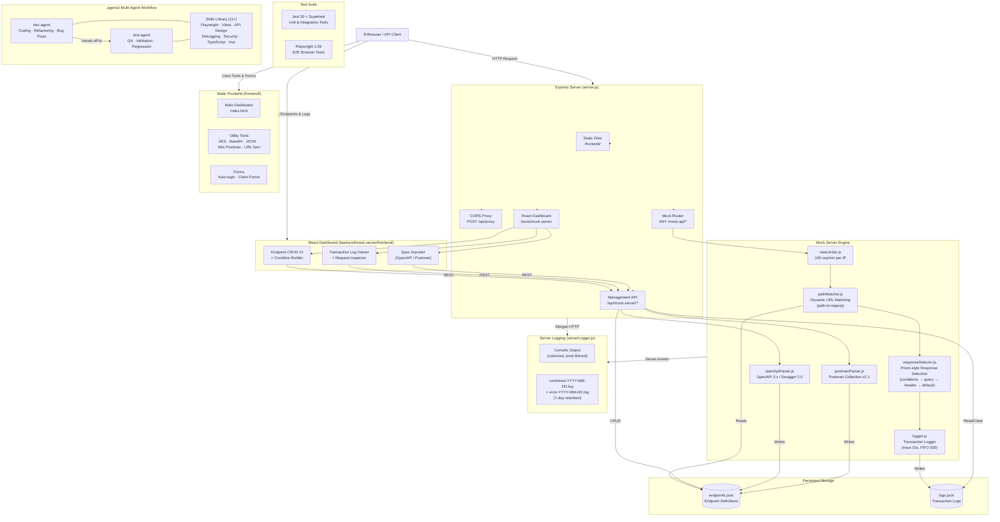
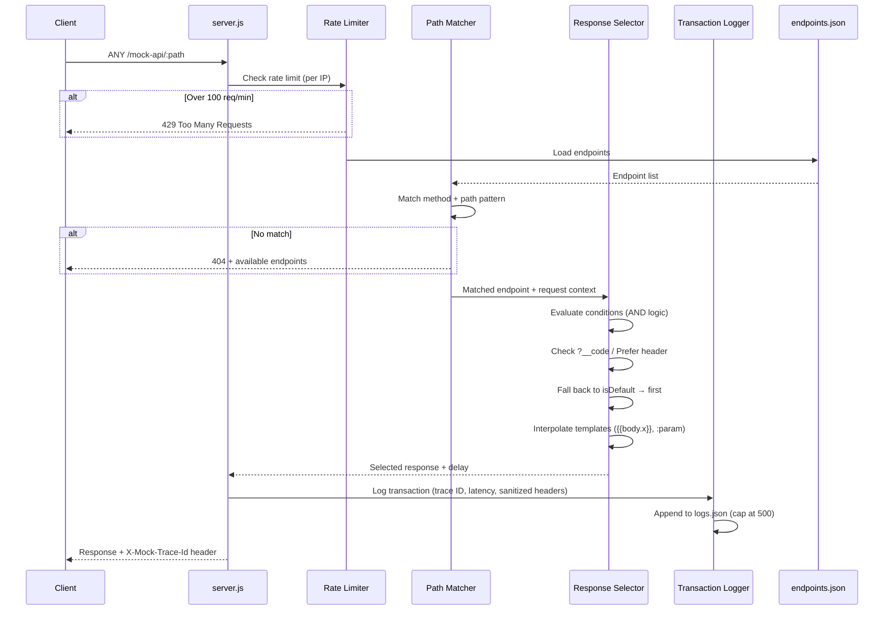
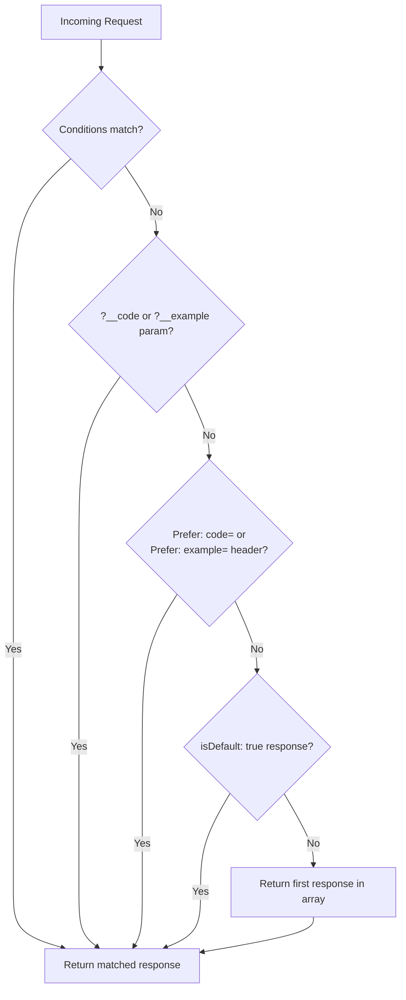
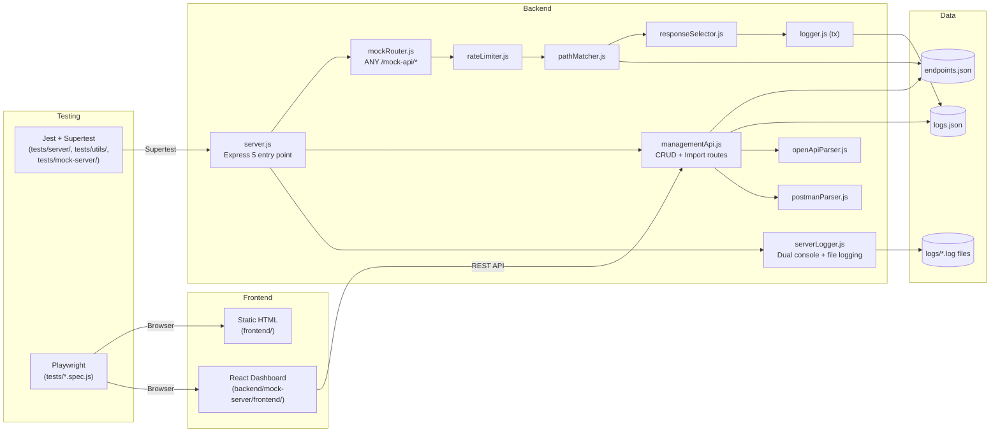

# Project Architecture Diagram

## System Overview

```mermaid
graph TB
    Browser["🌐 Browser / API Client"]

    subgraph Express["Express Server (server.js)"]
        Static["Static Files\n/frontend/"]
        Proxy["CORS Proxy\nPOST /api/proxy"]
        MockRouter["Mock Router\nANY /mock-api/*"]
        MgmtAPI["Management API\n/api/mock-server/*"]
        ReactDash["React Dashboard\n/tools/mock-server"]
    end

    subgraph MockEngine["Mock Server Engine"]
        PathMatcher["pathMatcher.js\nDynamic URL Matching\n(path-to-regexp)"]
        ResponseSelector["responseSelector.js\nPrism-style Response Selection\n(conditions → query → header → default)"]
        TxLogger["logger.js\nTransaction Logger\n(trace IDs, FIFO 500)"]
        RateLimiter["rateLimiter.js\n100 req/min per IP"]
        OAParser["openApiParser.js\nOpenAPI 3.x / Swagger 2.0"]
        PMParser["postmanParser.js\nPostman Collection v2.1"]
    end

    subgraph Storage["Persistent Storage"]
        EndpointsDB[("endpoints.json\nEndpoint Definitions")]
        LogsDB[("logs.json\nTransaction Logs")]
    end

    subgraph Logging["Server Logging (serverLogger.js)"]
        Console["Console Output\n(colorized, level-filtered)"]
        FileLog["combined-YYYY-MM-DD.log\n+ error-YYYY-MM-DD.log\n(7-day retention)"]
    end

    subgraph Frontend["Static Frontend (frontend/)"]
        Dashboard["Main Dashboard\nindex.html"]
        Tools["Utility Tools\nAES · Base64 · JSON · Mini Postman · URL Gen"]
        Forms["Forms\nAuto-login · Claim Forms"]
    end

    subgraph ReactFE["React Dashboard (backend/mock-server/frontend/)"]
        EndpointUI["Endpoint CRUD UI\n+ Condition Builder"]
        LogViewer["Transaction Log Viewer\n+ Request Inspector"]
        ImportUI["Spec Importer\n(OpenAPI / Postman)"]
    end

    subgraph Tests["Test Suite"]
        Jest["Jest 30 + Supertest\nUnit & Integration Tests"]
        Playwright["Playwright 1.59\nE2E Browser Tests"]
    end

    subgraph Agents[".agents/ Multi-Agent Workflow"]
        DevAgent["dev-agent\nCoding · Refactoring · Bug Fixes"]
        TestAgent["test-agent\nQA · Validation · Regression"]
        Skills["Skills Library (11+)\nPlaywright · Vitest · API Design\nDebugging · Security · TypeScript · Vue"]
    end

    %% Browser connections
    Browser -->|HTTP Request| Express
    Browser -->|Manages Endpoints & Logs| ReactFE
    Browser -->|Uses Tools & Forms| Frontend

    %% Express routing
    Express --> Static
    Express --> Proxy
    Express --> MockRouter
    Express --> MgmtAPI
    Express --> ReactDash

    %% Mock Router flow
    MockRouter --> RateLimiter
    RateLimiter --> PathMatcher
    PathMatcher -->|Reads| EndpointsDB
    PathMatcher --> ResponseSelector
    ResponseSelector --> TxLogger
    TxLogger -->|Writes| LogsDB

    %% Management API
    MgmtAPI -->|CRUD| EndpointsDB
    MgmtAPI -->|Read/Clear| LogsDB
    MgmtAPI --> OAParser
    MgmtAPI --> PMParser
    OAParser -->|Writes| EndpointsDB
    PMParser -->|Writes| EndpointsDB

    %% React Dashboard
    ReactDash --> EndpointUI
    ReactDash --> LogViewer
    ReactDash --> ImportUI
    EndpointUI -->|REST| MgmtAPI
    LogViewer -->|REST| MgmtAPI
    ImportUI -->|REST| MgmtAPI

    %% Logging
    Express -->|Morgan HTTP| Logging
    MockEngine -->|Server events| Logging

    %% Agents
    DevAgent -->|Hands off to| TestAgent
    DevAgent --- Skills
    TestAgent --- Skills
```

---

## Request Lifecycle (Mock API)

```mermaid
sequenceDiagram
    participant C as Client
    participant S as server.js
    participant RL as Rate Limiter
    participant PM as Path Matcher
    participant RS as Response Selector
    participant L as Transaction Logger
    participant DB as endpoints.json

    C->>S: ANY /mock-api/:path
    S->>RL: Check rate limit (per IP)
    alt Over 100 req/min
        RL-->>C: 429 Too Many Requests
    end
    RL->>DB: Load endpoints
    DB-->>PM: Endpoint list
    PM->>PM: Match method + path pattern
    alt No match
        PM-->>C: 404 + available endpoints
    end
    PM->>RS: Matched endpoint + request context
    RS->>RS: Evaluate conditions (AND logic)
    RS->>RS: Check ?__code / Prefer header
    RS->>RS: Fall back to isDefault → first
    RS->>RS: Interpolate templates ({{body.x}}, :param)
    RS-->>S: Selected response + delay
    S->>L: Log transaction (trace ID, latency, sanitized headers)
    L->>L: Append to logs.json (cap at 500)
    S-->>C: Response + X-Mock-Trace-Id header
```

---

## Response Selection Priority

```mermaid
flowchart TD
    A[Incoming Request] --> B{Conditions match?}
    B -->|Yes| Z[Return matched response]
    B -->|No| C{?__code or ?__example param?}
    C -->|Yes| Z
    C -->|No| D{"Prefer: code= or\nPrefer: example= header?"}
    D -->|Yes| Z
    D -->|No| E{isDefault: true response?}
    E -->|Yes| Z
    E -->|No| F[Return first response in array]
    F --> Z
```

---

## Multi-Agent Workflow

```mermaid
flowchart LR
    U["👤 User Prompt"] --> DA

    subgraph DA["dev-agent"]
        D1["Implement Feature\nor Fix Bug"]
        D2["Write / Modify Code"]
        D3["Run Build"]
    end

    DA -->|Hands off| TA

    subgraph TA["test-agent"]
        T1["QA & Validation"]
        T2["Run Jest + Playwright"]
        T3["Root Cause Analysis"]
    end

    subgraph SL["Skills Library"]
        S1["playwright-expert"]
        S2["vitest-testing"]
        S3["api-designer"]
        S4["debugging-wizard"]
        S5["secure-code-guardian"]
        S6["typescript-pro"]
        S7["vue-expert-js"]
        S8["websocket-engineer"]
        S9["django-expert"]
    end

    DA -.->|Loads| SL
    TA -.->|Loads| SL

    TA -->|Result| U
```

---

## Component Map

```mermaid
graph LR
    subgraph Backend
        SJ["server.js\nExpress 5 entry point"]
        SL["serverLogger.js\nDual console + file logging"]
        MR["mockRouter.js\nANY /mock-api/*"]
        MA["managementApi.js\nCRUD + Import routes"]
        PM["pathMatcher.js"]
        RS["responseSelector.js"]
        TL["logger.js (tx)"]
        RL["rateLimiter.js"]
        OA["openApiParser.js"]
        PP["postmanParser.js"]
    end

    subgraph Data
        EJ[("endpoints.json")]
        LJ[("logs.json")]
        LF[("logs/*.log files")]
    end

    subgraph FE["Frontend"]
        SF["Static HTML\n(frontend/)"]
        RF["React Dashboard\n(backend/mock-server/frontend/)"]
    end

    subgraph Testing
        JT["Jest + Supertest\n(tests/server/, tests/utils/,\ntests/mock-server/)"]
        PT["Playwright\n(tests/*.spec.js)"]
    end

    SJ --> MR & MA & SL
    MR --> RL --> PM --> RS --> TL
    PM --> EJ
    TL --> LJ
    MA --> EJ & LJ & OA & PP
    SL --> LF
    RF -->|REST API| MA
    JT -->|Supertest| SJ
    PT -->|Browser| SF & RF
```
